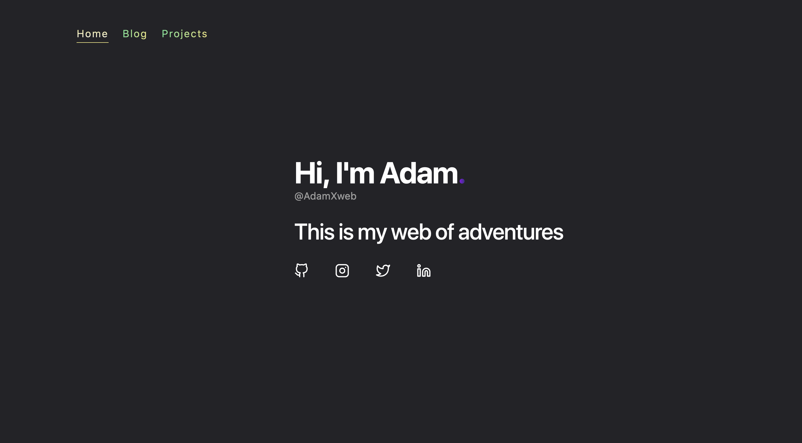

# AdamXweb.github.io
\

This is my blog created with Hugo. You can find the source code on the `dev` branch.\
Master branch updates automatically with a workflow when changes are detected.

Check the `dev` branch for details how to build
