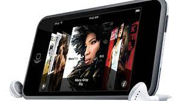
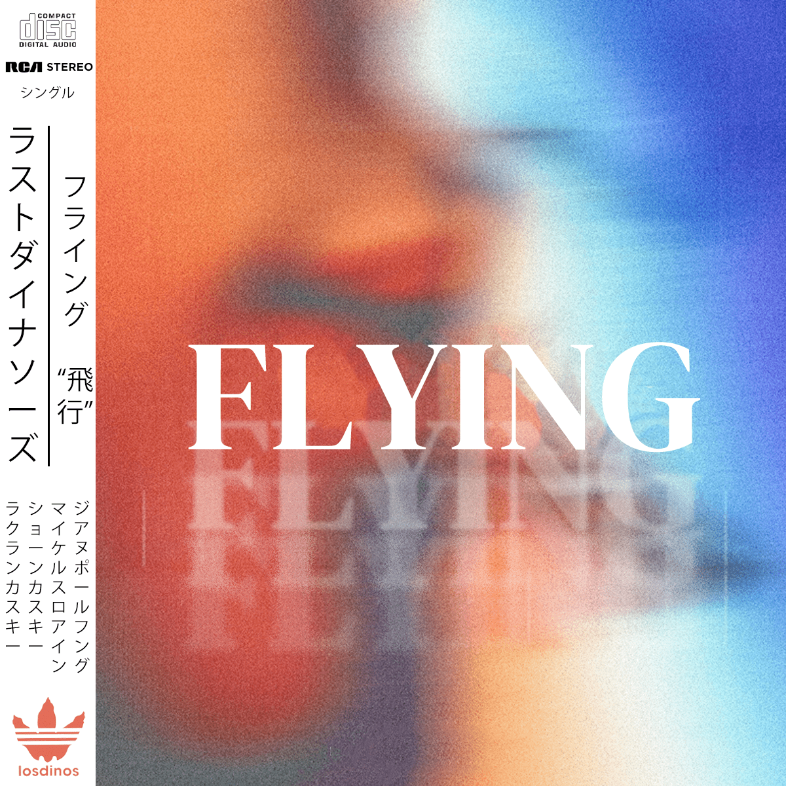

---

author: "Adam Kostarelas"
date: 2021-05-31T03:00:00Z
updated: 2025-10-03T21:00:00
description: "Beginning my journey into making Album art covers. "
image: "/uploads/compositingdrinkwine.png"
keywords: ["methyl ethel drink wine album art", "last dinosaurs flying album art", "photoshop album art"]
math: false
slug: "album-art"
tags: ["design"]
title: "Journey into making Album Art covers"
toc: false

---

Ever since I got an iPod touch back in the late 2000s, a key design standout has been how Album art can provide bias to decide whether or not to listen to a song. It can also at times provide a 'feeling' of the album. The feature i'm referring to of course is Cover flow:

During this lockdown in Melbourne, Victoria, I've decided to do a few pieces of digital art to refine my photoshop skills, and to see it as a way to try to understand the 'feeling' of music.

I do understand that a lot of my art is unrefined. The challenge I'm undertaking is to spend an hour on a composition based on a song e.g. the title, the feeling listening to it etc. I want to limit the time as a way to make something simple, and achievable.

My first attempt at creating an album art was for [Last Dinosaurs](https://lastdinosaurs.com/home/ "Last Dinosaurs website") when they released their Single; Flying.

