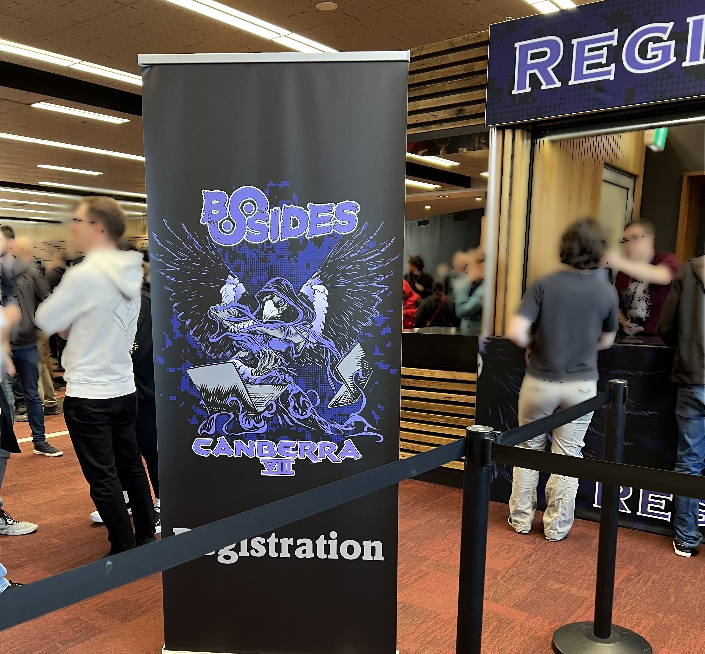
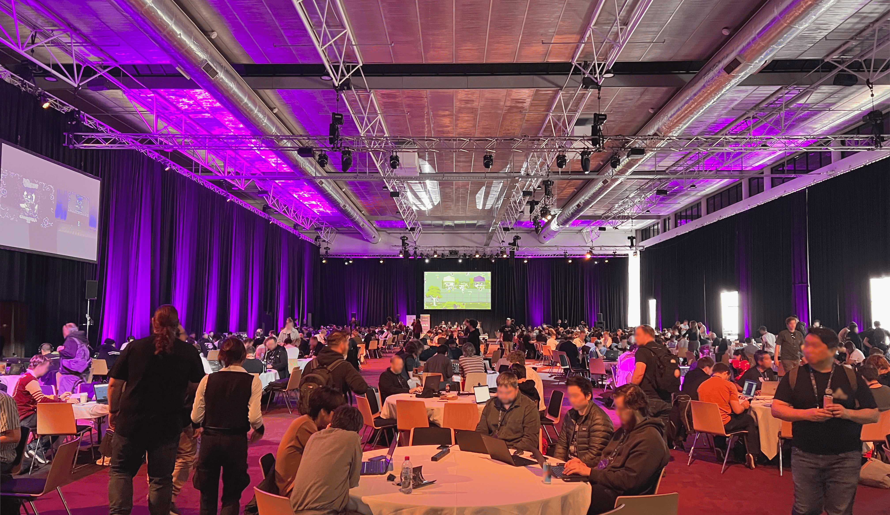
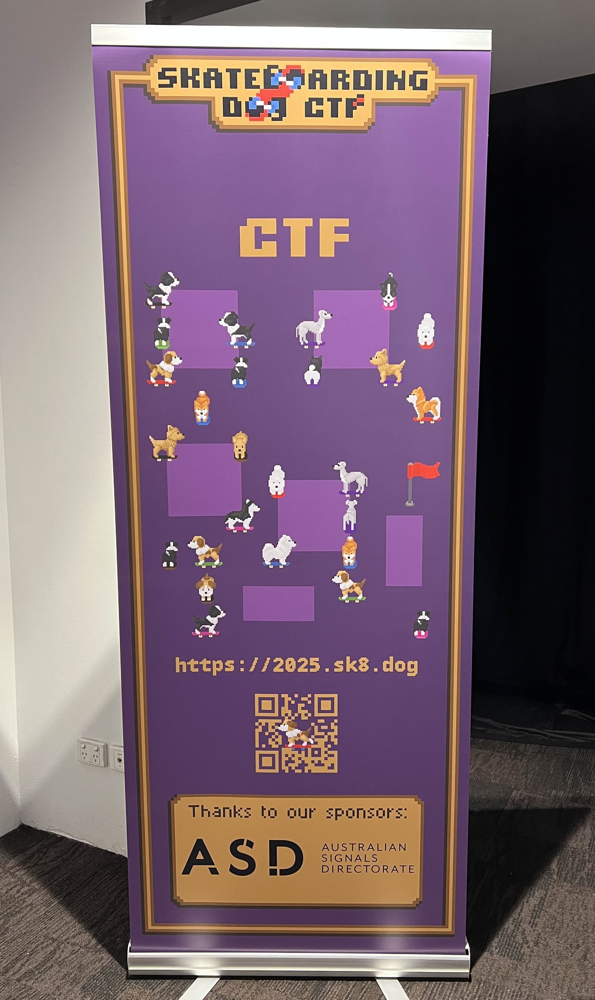
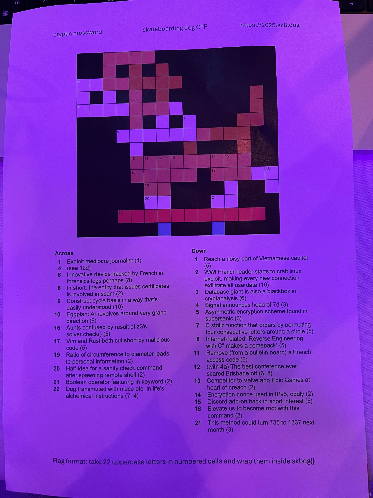
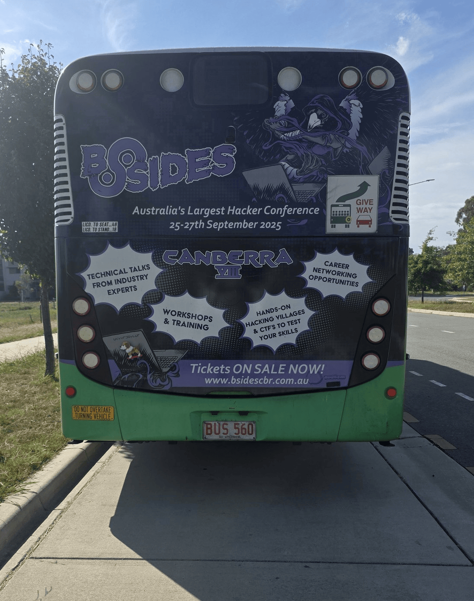
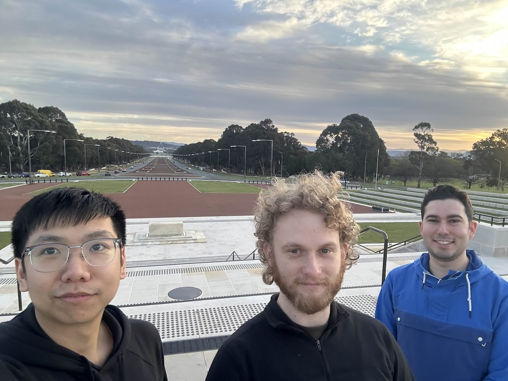
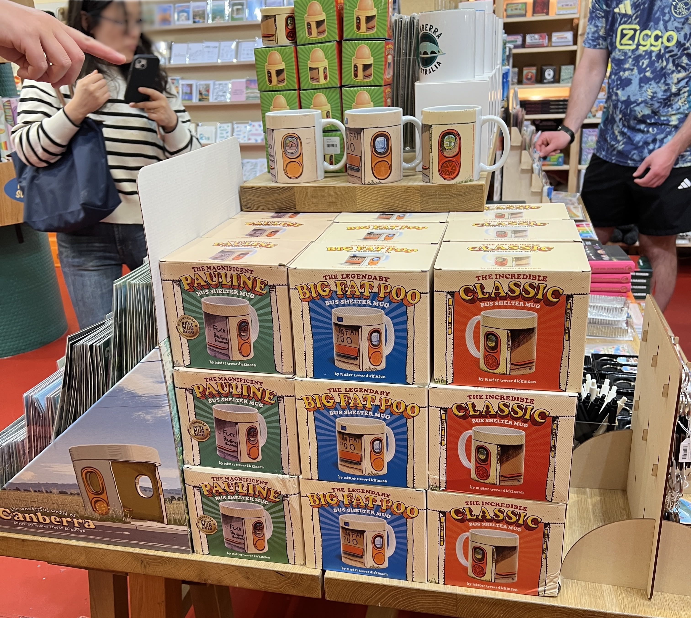

# Conference takeaways

This was my first time heading interstate for a conference, and honestly it was an incredible experience! I’m grateful to VCOSS for their support in making this trip to BSides in Canberra
possible.

## First impressions

Arriving on Thursday morning was a bit of a shock, as the venue was absolutely packed. I wasn't expecting it to be as large of an event as it was was, especially considering the student price ticket of $75.

I think BSides provides a safe space for the cyber community to grow. There are countless people that I met, including people from other universities, industry, government and some people who were quite open about the kind of work they do, to offer advice, share tips and people were striking up conversations. It felt like a welcoming space for anyone involved in cybersecurity, regardless of their background.

## Favourite talks

Whilst I spent most of the Saturday working on the CTF, I still managed to sneak out to see a few talks. There was a great variety of super technical, entertaining and approachable sessions. The ones most relevant to me where:

### Bitsquatting dot gov.au domains – exploring network data bitflips in DNS traffic - Matt Belvedere
This talk felt like a guest lecture at uni. Seeing how concepts of networking were tested in a real-life scenario was very insightful. The display of binary bits in a domain, and learning about the attack scope of how all bits could be ‘flipped’ really drove home the potential for threats in unexpected ways. The theory was that solar flares could flip a bit from a 1 to a 0, and aligned it with the traffic from a random .au domain.

For example the binary for `.gor.au` is:\
`00101110 01100111 01101111 01110010 00101110 01100001 01110101` 

Where as `.gov.au` is:\
`00101110 01100111 01101111 01110110 00101110 01100001 01110101`\

Can you see the difference? I've added a [resource](/resource/binary-alphabet/) if you wanted to lookup the alternate options yourself.

Its surprising that auDA allowed these domains to be registered.. Then again when you register a domain, technically your business details are linked to it... The example given is what if someone registered a dubious domain under your business name, then got your main domain banned and taken down? What would the downtime and impact be, and how can it be prevented?

### let’s make malware but it might get caught so the malware gets worse ☣️ - "Alex"
This was a great and engaging talk. I think it was wise to not delve too deep into actual 'malware', but to stay high level. Revolving around the evasion part, it was informative to understand ways that threat actors could obfuscate their malware by encrypting the contents to evade detection. With the distribution of the malware, a non-existent user agent may be used to deliver a payload, but serve a normal file if anyone else inspects it, like the modern version of a secret knock but to infect a computer...?

### WTF is a TLA? Come and play a fast round of Cyber Buzzword Bingo - Jeremy Keast
This was a fun talk, an overload of buzzwords to really drive home how obscene it can be at times. I didn't catch the whole talk, and can definitely say quite a few of the acronyms went over my head.

## CTF

The CTF definitely had a vibe pumping. ['Hacker music'](https://music.apple.com/au/playlist/skateboarding-dog-ctf-2025/pl.u-DdANXleCap22EP) (Copy of the playlist) and mood lighting. 

My team, [Phishing Season](https://discord.gg/PkRRXfdRBY) was participating in the event run by skateboarding dog. I found it quite challenging, as most of the questions required a decent amount of knowledge in an area even if they were marked 'easy'. You can read my [writeup](/blog/okay-buddy-2025/) about a challenge I was able to learn quite a bit from.

We spent the Saturday morning working together, breaking down challenges and learning that ChatGPT would only lead you down a rabbit hole, leaving you more puzzled than before you'd ask a question. It did help to form a prompt in a different way to try to understand different ways you could solve something, but ultimately it wasn't helpful (at least in its current form in 2025).

There were a few fun challenges that required us to get up and try to solve how the 'dogs were moving around the room', to solve a couple crosswords and to find and identify the characters on the back of this bus. (yes the bus picture was that low resolution)


  
  
  


The challenge I wasn't able to solve that I sunk a lot of time into was the "Speak with Animals", which required either intense concentration, a great sense to lip read or the patience to map out each phonetic phrase spoken. (all of which I struggled with on such an action packed day.)

A shout out to Junjie and Nick for being awesome team mates during the ctf and at the conference! [#Monsec](https://monsec.io/)

## Trip photos

It's been a while since I travelled. There were a few nice shot opportunities I couldn't resist taking.

### Trip home

  
  
  


### Bonus
The whole of Canberra felt alive with everyone from the conference. You could easily spot someone in stereo-typical clothing of 'hoodie, black t-shirt, beard or glasses' on their way either to or from the convention centre.
Whilst there were some side activities such as lockpicking and various vendors selling penetration testing tools, it felt oddly strange to see it in action at my hotel as I was checking out. I guess someone locked themselves out and wanted a challenge to get back in?

Canberra as a city is also quite unique, but I wasn't quite expecting to be able to take home a mug, egg holder, earring or bookmark all shaped as the bus stops..

Ultimately, BSides Canberra was about more than just acquiring knowledge; it was about
connecting with like-minded people and learning more about the industry I’m working my way
into. I'm already looking forward to sharing my experiences and continuing to learn from the
community.

Do you have any thoughts on the BSides conferences, or recommendations on what other events I should go to?
