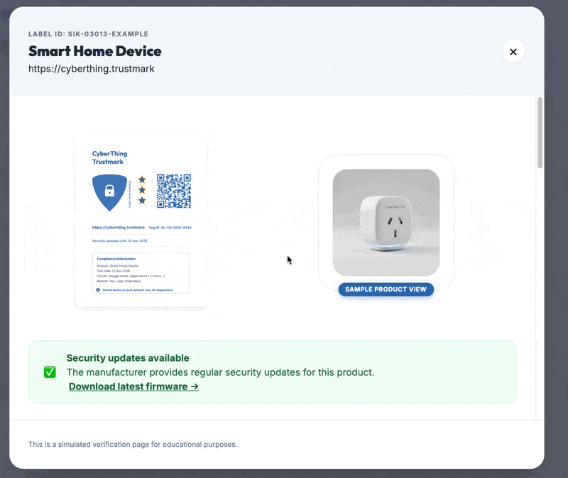
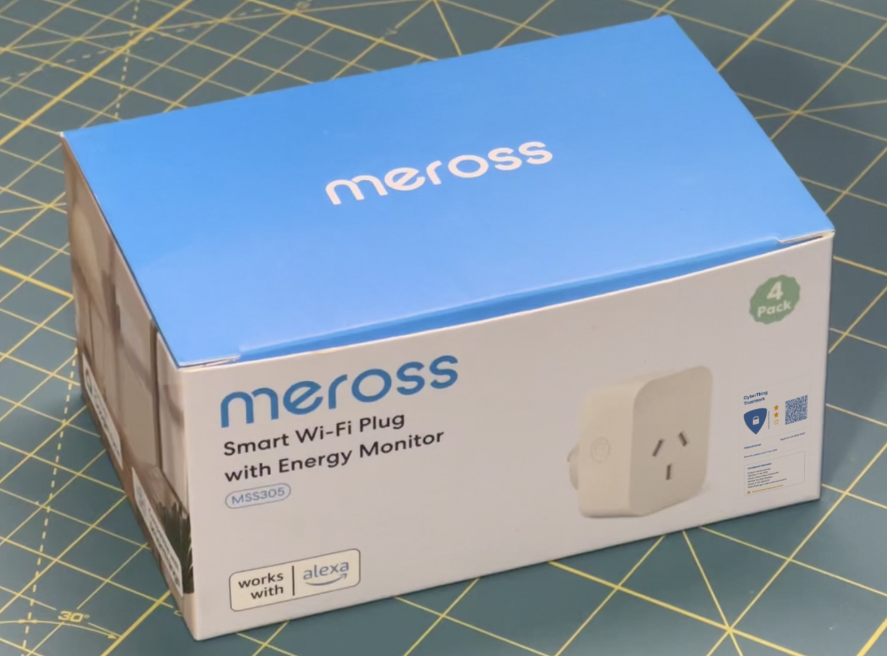
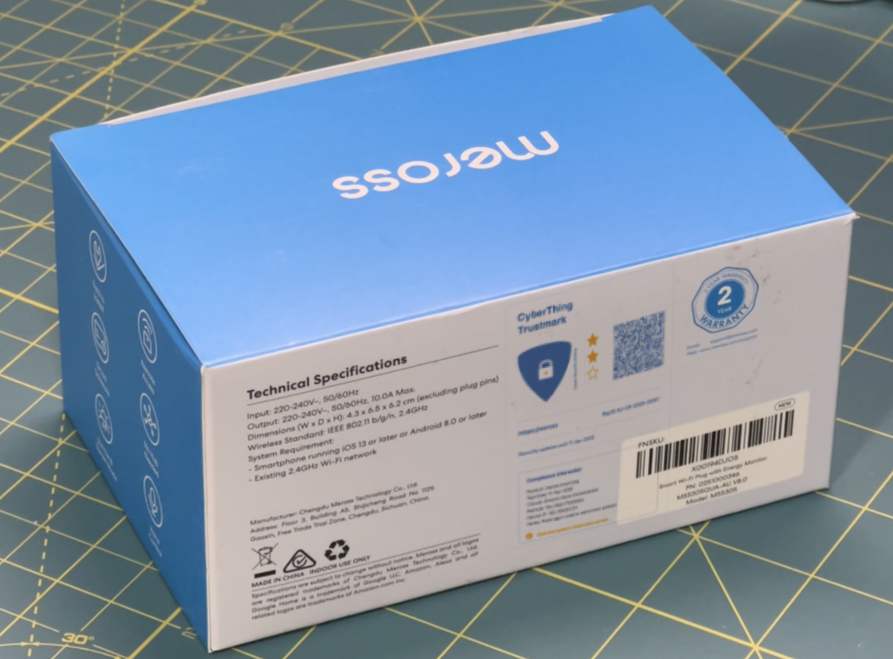
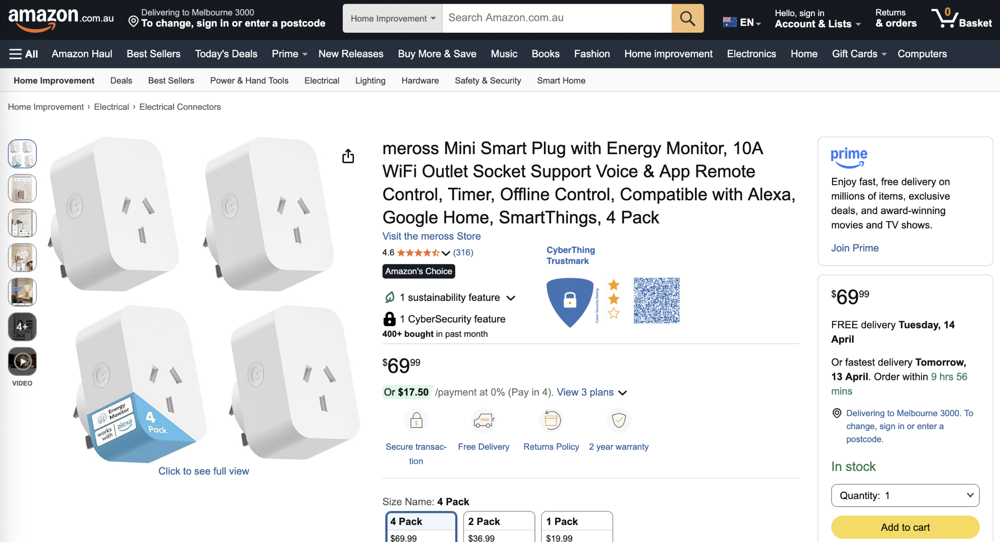
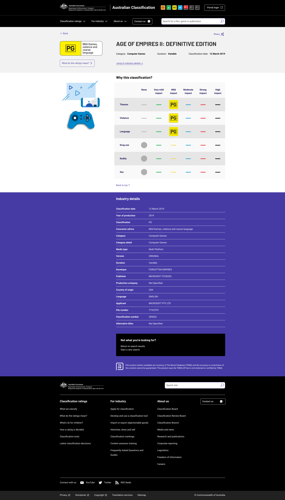
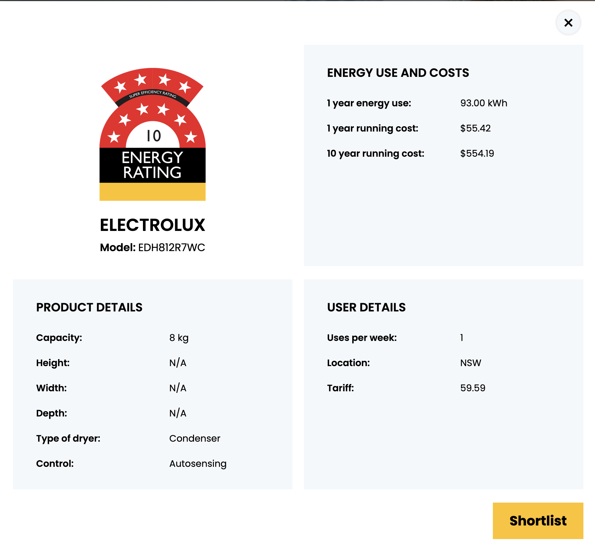
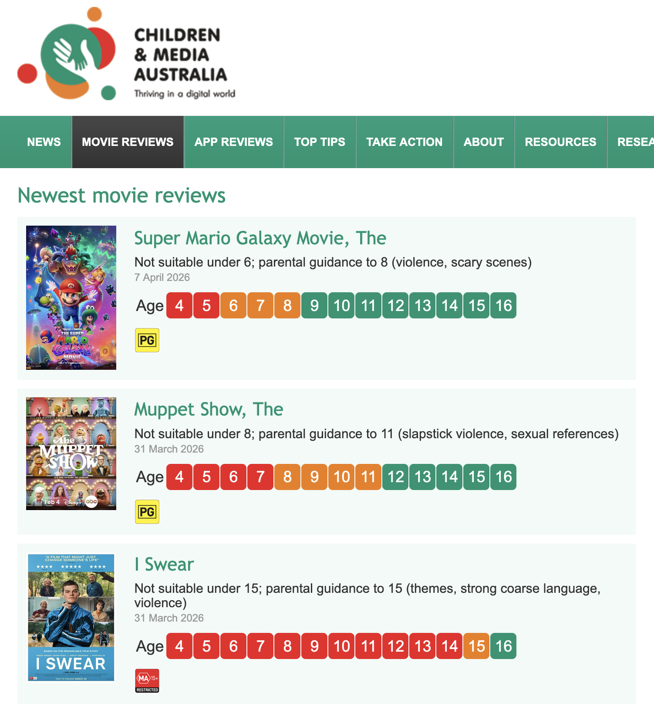
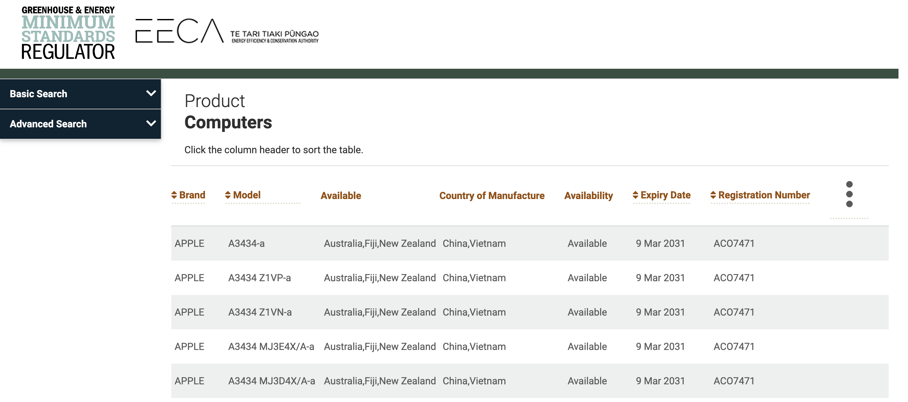

I spent a rainy Melbourne weekend building a functional mockup of a [proposed](https://www.connectedtechnologyalliance.com.au/labellingscheme) cybersecurity label for consumer electronics. Think of it like an energy star rating, but for device privacy and security.

As a consumer, it's almost impossible to know what a device is going to do when you bring it home. Do you need a proprietary app? Does it send data overseas? Does it connect to the internet?
It's also fairly common to see abandonware on shelves, where products rarely receive any security updates. If mandatory labelling was on all devices, you'd know if there were any Common  Vulnerabilities and Exposures (CVEs), or if the brand has a reputation for poor security practises.

Here is a preview of what you'd see when scanning a QR code. BTW the ["CyberThing Trustmark" is a real website btw](https://cyberthing.awesome-aussie.com) 

If you're buying it off a shelf, you can pick up the product, seeing the security stars on front and back with compliance info.

  
  

Or on Amazon (albeit there'd be a link not a QR code)

### DIY Label

As part of the design process, I took inspiration from [eigenmagic's](https://cybersecure.eigenmagic.com/) **CyberSecure™ rating** as well as the Australian Government's Department of Home Affairs cybersecurity labelling scheme [proposal](https://www.connectedtechnologyalliance.com.au/labellingscheme), which we could see on shelves and online in March 2027.

The site is an interactive label maker, designed in a way where you could print it off and stick it on your IoT to keep track of its IP address, login URLs etc. The QR codes are dynamic, with parameters in the URL auto filling the label - meaning you can share the URL, download the png or do whatever really. The source code is on [Github](https://github.com/adamXbot/CyberThing-Trustmark), pull requests accepted :)

There's a bit you can configure for your label - even the QR code updates on the fly!


### How it was made

Now it's time to mention AI. As a part-time student and having a part-time job, I don't always have time to work on ideas and execute them. Using Gemini 3 Flash allowed me to turn this into a Saturday arvo thing and not take up my spare time over a week. I'm a first-time user of LLMs, and I've made the choice to publish all the code on a separate GitHub account - one that i've used previously for any automated git commits - [AdamXbot](https://github.com/adamXbot/). I completed everything in a VM running Google's Antigravity IDE, which controlled Chrome as it implemented my prompts. There were multiple iterations, with about 5 hours of active usage, draining 80% of the available quota of a Google AI Pro trial. I did also request that it test against OWASP top 10, and XSS particularly as people would potentially be using it to create URLs to share with others. Again, the source code is on [Github](https://github.com/adamXbot/CyberThing-Trustmark) to inspect if you prefer, before visiting the mockup ["CyberThing Trustmark"](https://cyberthing.awesome-aussie.com) site.

### Examples of Other Consumer Marks

There are great examples of Trustmarks from overseas like the [BSI IT Security Label in Germany](https://www.bsi.bund.de/SharedDocs/IT-Sicherheitskennzeichen/EN/2025/sik-05165.html#_5copl695n).

It helps to look at existing labelling systems for our mockup to get ideas of what's good.

Visually, they all serve a purpose to communicate a piece of information. As a shopper, you may not have time to understand complex concepts or read technical jargon. Simple is king.


  
  
  


(Note: While these are good examples, a "bad example" of where scanning a QR on a trustmark would be a loading static database entry that offers no immediate value to the shopper.)

## Stats of how much this is used
I've made the live website stats public on my [Simple Analytics dashboard](https://dashboard.simpleanalytics.com/cyberthing.awesome-aussie.com).
If you've refreshed the page enough, you'll also see the RegID number increase. It's using counterapi.dev so technically like the old day website counters. Something to note is that it doesn't save any info, and that you control it all via URL Params. You can also clone the Repo and strip out the analytics, counterapi calls if you want a private version to tinker with.

## Links / Credits

As i've added screnshots above, you can find the full pages at:
- [Game Classification Government website](https://www.classification.gov.au/titles/age-empires-ii-definitive-edition)
- [Energy Rating Database](https://reg.energyrating.gov.au/comparator/product_types/73/search/comprehensive/?wrapper_search=&expired_products=on&brand_names=apple&model_number=)
- [Energy Calculator example of a dryer](https://calculator.energyrating.gov.au/DryerDetails.aspx)
- [Children and Media movie reviews example](https://childrenandmedia.org.au/movie-reviews/by-date-added/newest)

EDIT:
Also a huge shoutout to [@decryption](https://decryption.net.au) for giving me some helpful advice for me to rewrite this - original version was very clunky to read.

## Check it out!
See the security label for yourself, and please feel free to leave a comment - i'm open to feedback or questions!

[CyberThink Trustmark Website](https://cyberthing.awesome-aussie.com)

## Credits
