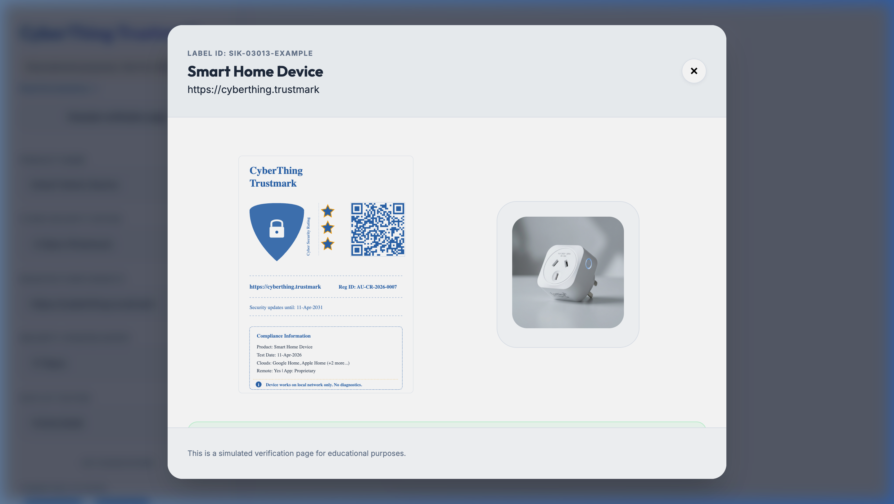
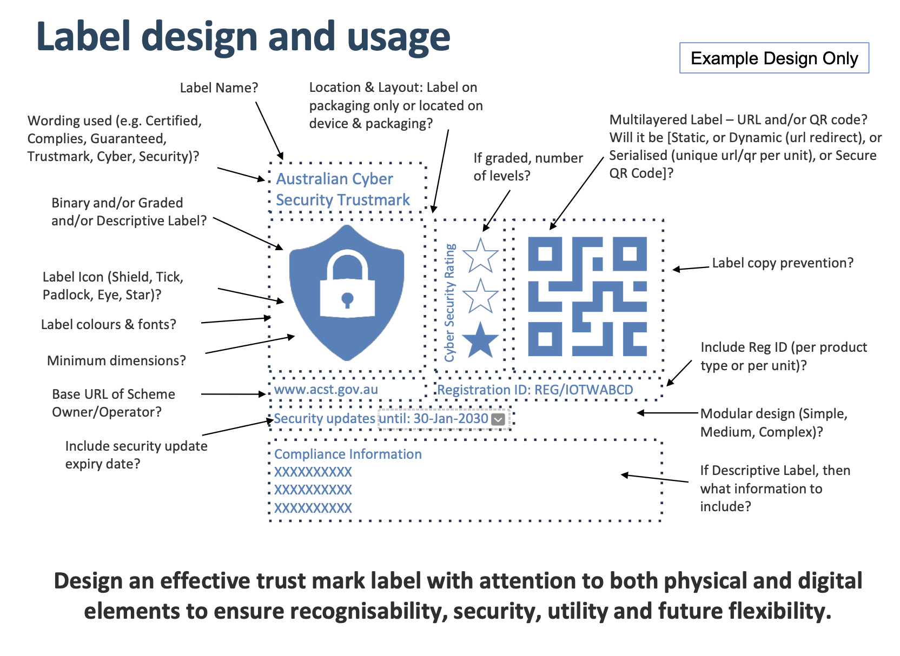

Sometimes the best learning happens on a Saturday afternoon when you're just tinkering for fun. With rainy Melbourne weather outside, I booted up an AI and had a go at a creative experiment: designing a mockup ["CyberThing Trustmark"](https://cyberthing.awesome-aussie.com) for consumer electronics. 

As a privacy and security advocate, i'm all for supporting organisations being transparent about how their device works, and what kind of data is collected and how it is used.

## Where the Idea Came From
The inspiration was from two places. First, I'm a fan of [eigenmagic's](https://cybersecure.eigenmagic.com/) **CyberSecure™ rating.** I was also reading about the Australian Government's Department of Home Affairs cybersecurity labelling scheme proposal, which aims to help consumers assess and compare the security of smart devices on Australian shelves and online.

What if, during the design phase of these schemes, we could simulate what consumers might actually see? We could set the bar high, so to speak. A Trustmark would also be something you could imagine seeing on a shelf next to a smart bulb, connected thermostat or smart switch, or somewhere on a page online.

It may also come with a side bonus of actual use, if you wanted to print it out as a label with device info like IP address, login pages etc.

### Examples of Other Consumer Marks

There are great examples of Trustmarks from overseas like the [BSI IT Security Label in Germany](https://www.bsi.bund.de/SharedDocs/IT-Sicherheitskennzeichen/EN/2025/sik-05165.html#_5copl695n).

It helps to look at existing labelling systems for our mockup to get ideas of what's good.

Visually, they all serve a purpose to communicate a piece of information. As a shopper, you may not have time to understand complex concepts or read technical jargon. Simple is king.


  
  
  


(Note: While these are good examples, a "bad example" of where scanning a QR on a trustmark would be a loading static database entry that offers no immediate value to the shopper.)

## Building the fake CyberThing Trustmark

### Use of LLMs in this project

I want to make it clear how I used LLMs and why. As a part-time student and having a part-time job, I don't have enough time to look into projects or ideas I have. As such, being a first-time user of LLMs, I was able to get a one month trial of the Google AI Pro plan.  Monash University does give students access to Gemini which includes the latest models, however it is limited to the web only, meaning I couldn't test in Google's Antigravity app.
Surprisingly, the university has been very encouraging for students to use AI to assist in the brainstorming phase of projects and to help draft out any work.

All of the development was done in a virtual machine, and I've made the choice to publish all the code on a separate GitHub account - one that i've used previously for any automated git commits - [AdamXbot](https://github.com/adamXbot/), and one that I will continue to do if any projects are created mostly with LLMs. I may change my view on this in the future as more AI gets baked into apps. I used the stock experience, with to MCP or skills, however it did prompt me to install Chrome, and it controlled the browser to 'validate' itself and take screenshots.

That being said, I also wanted to see the capabilities of an AI for something that would have taken me about a week in my spare time to create, which shortened a functional mockup down to a day.

I had an idea of what I wanted to create and its functionality, and the AI was carefully prompted over multiple revisions to develop a webpage to simulate how a trustmark could function. I did also request that for a security page it test against OWASP top 10, and XSS particularly as people would potentially be using it to create URLs to share with others. I used the Gemini 3 Flash model on my own account, and whilst its difficult to transparently track token usage, it did use 80% of a single daily quota, with about 5 active hours.

As this was made with AI, I'd encourage you to inspect the entirety of the soucecode on [Github](https://github.com/adamXbot/CyberThing-Trustmark), albeit only a CSS, Javascript and HTML file. 

One interesting side note is that for fonts, it must be trained to prioritise importing a Google font from their library. Then again this is the only project i've used AI for, so next timee may be different?

### Mockup to simulate consumer decision

For this weekend project, I tried to create something that someone could theoretically fill out and stick on their IoT device. It's a mockup designed to include the information I, as a consumer, would find most helpful when purchasing a product. As such, the page has:

- Clear star ratings that would communicate security posture at a glance, with plain-language explanations of what those stars actually mean.
- When scanning the QR code, ideally more information about the product and brand are shown
- Consumer Context: Details on what the security rating means for the user, including whether the device locks them into a specific ecosystem or remains open for tools like Home Assistant (essentially: Do I need a proprietary app to use this?).

A mockup like this leaves out many complexities a real scheme would require, but I wanted to focus purely on the consumer point of view. Many people may not care that a Ring doorbell sends data to Amazon, but a significant percentage of consumers might think otherwise if that information were clearly visible.

I didn't want to go too deep into building a "real system," but I believe this strikes a good balance of features that a future real-world system could adopt.

I utilised Google Gemini 3 Flash to create the page.

Check it out [below](#check-it-out)

## What it's based on - The Gov draft design

The sample label can be found in the [IoT presentation](https://www.connectedtechnologyalliance.com.au/labellingscheme) which outlines a plan to create a trustmark similar to the energy star rating, with a rollout targeted for March 2027.

The Australian Government's initiative is a step in the right direction, but until these labels become standard and verifiable, consumers still aren't aware. My mockup is just a weekend experiment, but it highlights what transparency could look like in practice.

## Mock example
I thought it would be cool to also do a quick mockup in Affinity Photo to put the CyberThing Trustmark on a real product I purchased.

If I saw it on the shelf, i'd preview the QR code, and if it had a `.gov.au` URL at the end, it'd be neat to see the individual product info.


  
  


it's a bit harder to mock up e-commerce sites, as most likely it would either be a product image, or just linked directly to the Trustmark scheme to verify it's still active.

## Links

[I've made the live website analytics public on a dashboard](https://dashboard.simpleanalytics.com/cyberthing.awesome-aussie.com)

[Game Classification Government website](https://www.classification.gov.au/titles/age-empires-ii-definitive-edition)\
[Energy Rating Database](https://reg.energyrating.gov.au/comparator/product_types/73/search/comprehensive/?wrapper_search=&expired_products=on&brand_names=apple&model_number=)\
[Energy Calculator example of a dryer](https://calculator.energyrating.gov.au/DryerDetails.aspx)\
[Children and Media movie reviews example](https://childrenandmedia.org.au/movie-reviews/by-date-added/newest)

## Check it out!
See the security label for yourself, and please feel free to leave a comment - i'm open to feedback or questions!

[CyberThink Trustmark Website](https://cyberthing.awesome-aussie.com)