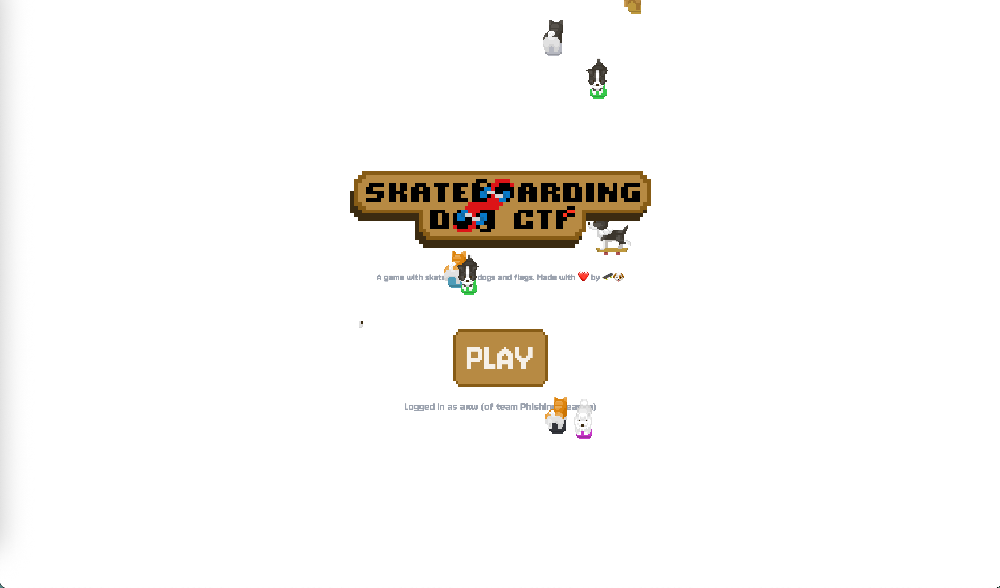
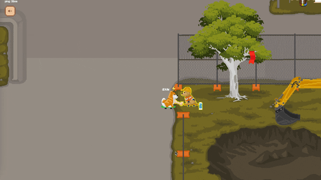
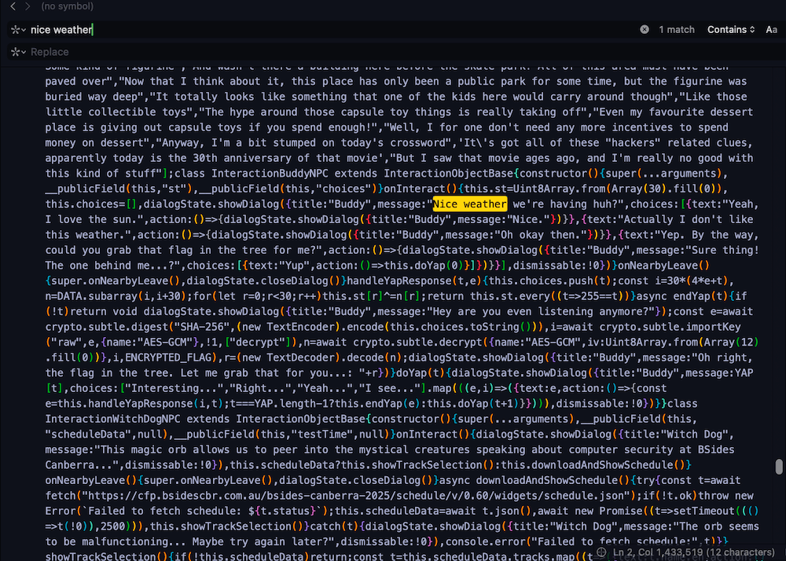
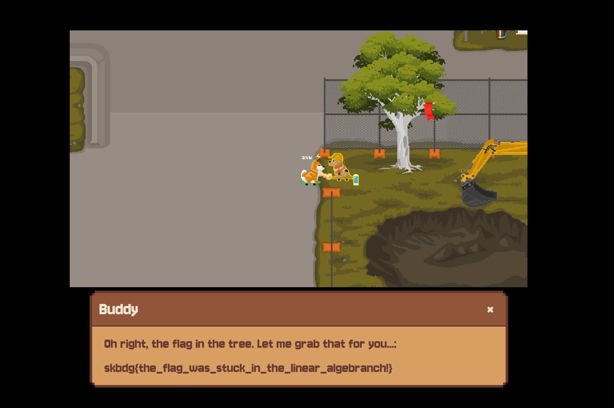
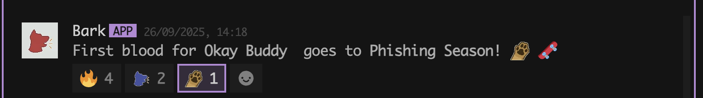

 

I've only done a handful of CTF challenges before and found that I've gravitated towards forensics, OSINT and some cryptography.
This challenge was outside of my comfort zone, but I wanted to persist and try something new.

It's fun when there's a theme to a CTF, and skateboarding dog did an amazing job with the 2D pixelart and game.

## Skateboarding dog CTF writeup

### Okay Buddy

There's a flag in the tree, and Buddy is so close to help us grab it.
When chatting to Buddy something seems wrong..

 

There are always 4 options to choose from and it's not super obvious what replies are correct, with 'Interesting, Right, Yeah and I see'.

Time to inspect the code and try to find why we're having such nice weather.
 

The source code reveals that the correct sequence of responses will unlock the encrypted flag.
Trying to brueforce it won't work, as there are `4^30` possibilities.

Two important constants are defined:

`DATA` is a huge base64 blob, which we can later use to XOR against a “state” buffer and 
`ENCRYPTED_FLAG` is the AES-GCM cipher text of the flag.


Even though it looks like a silly conversation, the game is secretly adding digits for every response being 30 numbers long.

The game starts with a state that’s all zeroes and every time you make a choice, the game combines that block with the current state using XOR. After 30 moves if your state is all ones buddy gets the flag, if not you need to listen more closely..

To try and solve this, as we can't do it easily with bruteforce, theres another way using math. understood this like sudoku, if a 'number' doesn't fit in a square, stop and try something else.


| Sudoku  ✍️              | XOR Puzzle chatting with Buddy 🐶   |
| --------------------------------- | ------------------- |
| Sudoku cell (to be filled)        | Buddy Yapping        |
| Candidate number (1–9)     | Response, I see etc.   |
| Sudoku rule check (row/col/box)   | XOR lock check      |
| Wrong number, erase & backtrack | Response fails        |
| Number fits, continue           |Response passes       |
| You win the Sudoku puzzle      | Flag taken from the tree |


``` javascript
     Sudoku                          Buddy Conversation 

Step 1: Start                Step 1: Yap 1
. . . | . . . | . . .        ├
. . . | . . . | . . .        ├─ Interesting (1) → "You know, trees like that one..." ✅ Continue
. . . | . . . | . . .        ├─ Right (2) → "Oh okay then." ❌ Prune
------+-------+-------       ├─ Yeah (3) → "Hmm, not quite." ❌ Prune
. . . | . . . | . . .        └─ I see (4) → "Wrong choice!" ❌ Prune
. . . | . . . | . . .
. . . | . . . | . . .
------+-------+-------
. . . | . . . | . . .
. . . | . . . | . . .
. . . | . . . | . . .

--------------------------------------------------------------

Step 2:                       Step 2: Yap 2
Place "5" in Cell (1,1)
5 . . | . . . | . . .         ├─ Interesting (1) → "No, not helpful." ❌ Prune
. . . | . . . | . . .         ├─ Right (2) → "Hmm, not quite." ❌ Prune
. . . | . . . | . . . 		  ├─ Yeah (3) → "If your park has a bunch of lollipop trees..." ✅ Continue
------+-------+-------        └─ I see (4) → "Wrong path!" ❌ Prune
. . . | . . . | . . .                   
. . . | . . . | . . .
. . . | . . . | . . .
------+-------+-------
. . . | . . . | . . .
. . . | . . . | . . .
. . . | . . . | . . .

--------------------------------------------------------------

Step 3:         			  Step 3: Yap 3
Place "3" in Cell (1,2)
5 3 . | . . . | . . .         ├─ Interesting (1) → "Not quite." ❌ Prune
. . . | . . . | . . .         ├─ Right (2) → "Wrong again." ❌ Prune
. . . | . . . | . . .         ├─ Yeah (3) → "Trees like those are actually doing more harm..." ✅ Continue
------+-------+-------        └─ I see (4) → "That’s not it." ❌ Prune
. . . | . . . | . . .         
. . . | . . . | . . .
. . . | . . . | . . .
------+-------+-------
. . . | . . . | . . .
. . . | . . . | . . .
. . . | . . . | . . .

--------------------------------------------------------------

Step N: Completed Grid         Step N: Yap Flag
5 3 4 | 6 7 8 | 9 1 2          ├─"Oh right, the flag in the tree. Let me grab that for you..." ✅
6 7 2 | 1 9 5 | 3 4 8		   └─ skbdg{flag}
1 9 8 | 3 4 2 | 5 6 7
------+-------+-------
8 5 9 | 7 6 1 | 4 2 3
4 2 6 | 8 5 3 | 7 9 1
7 1 3 | 9 2 4 | 8 5 6
------+-------+-------
9 6 1 | 5 3 7 | 2 8 4
2 8 7 | 4 1 9 | 6 3 5
3 4 5 | 2 8 6 | 1 7 9


```

I used **AI** to help build a script to run the XOR and eventually decrypt the flag. 

```
(env) ➜  okay buddy python3 aisolver.py
Loaded DATA: total bytes=3600, groups=30
Simulating known choices...
SUCCESS: final state is all 0xFF (condition satisfied).
Derived AES key (SHA-256 of choices string): 5ff0f7de257c5e9f327acbc77a227e9e45953855fa5cbf3c9f6fa247db4f03ab
--- DECRYPTED FLAG ---
skbdg{the_flag_was_stuck_in_the_linear_algebranch!}
----------------------
```

[Python Script for your inspection](https://github.com/AdamXweb/AdamXweb.github.io/tree/master/blog/okay-buddy/code/aisolver.py "AI generated script on Github") 

By writing a little script to explore the possibilities, we unlocked the secret responses that the game wants to get the flag.

### Flag found!

`skbdg{the_flag_was_stuck_in_the_linear_algebranch!}`

The script solves and decrypts the flag, but that's no fun. We can also go through the options to see the satisfaction of Buddy giving us the flag too.. (for validation reasons)
 


### Technical info

Even though the puzzle looked like we had to find the right sequence based on how Buddy was feeling, it was really a math puzzle in disguise.

XOR-based state machines are essentially linear algebra problems in disguise. When AES keys are derived directly from deterministic state (responses to buddy), reverse-engineering the selection logic allows us to reconstruct the exact key.

Combining static analysis with scripting makes it possible to recover the flag without ever playing through the game.

The important function to know when chatting to Buddy is:
``` javascript
handleYapResponse(t, e) {
	this.choices.push(t);
	const i = 30 * (4 * e + t),
		  n = DATA.subarray(i, i + 30);
	for (let r = 0; r < 30; r++) this.st[r] ^= n[r];
	return this.st.every((t => 255 == t))
}

```

As this checks if your conversation choices are correct at each step.\
The script simulates `this.st` starting at zero, and XORs the 30-byte block `DATA.subarray(30*(4*g + choice) , 30*(4*g + choice)+30)` for each group `g (0..29)`.
After XORing, the function checks if every byte in `this.st` equals 255.

`DATA` = all candidate numbers and rules encoded.\
`st` = the current partially filled grid state.\
`XOR step` = checking your number fits all rules for that cell.\
`every == 255` = the grid is valid for now.

Similar to above, it solves like:
``` javascript
Initial state:
st = [0, 0, 0, ..., 0]  (30 bytes)

Step 1 (Yap choices):
 ├─ Interesting
 │    XOR DATA[0:30] → st updated
 │    st != all 255 -> pass ✅ Continue
 │
 ├─ Right
 │    XOR DATA[1*30:1*30+30] → st updated
 │    st != all 255 -> fail ❌ Prune
 │
 ├─ Yeah
 │    XOR DATA[2*30:2*30+30] → st updated
 │    st != all 255 -> fail ❌ Prune
 │
 └─ I see
	  XOR DATA[3*30:3*30+30] → st updated
	  st != all 255 -> fail ❌ Prune
```

This was a personal achievement to understand the problem and to solve it, and a bonus to be the first!
 

Looking forward to participating again next year!