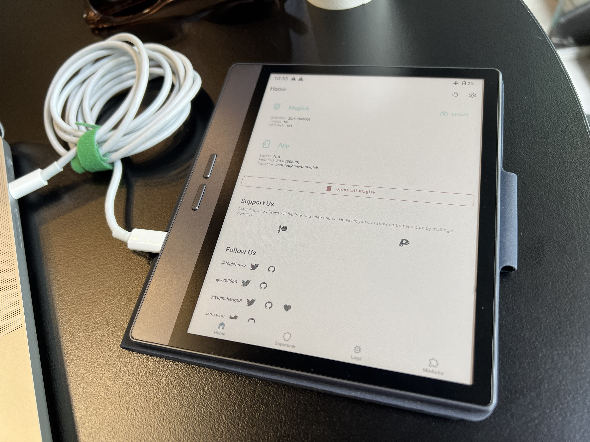
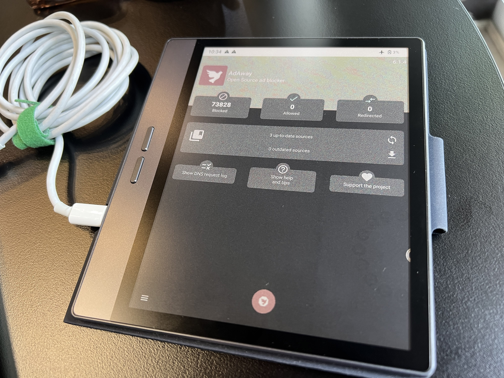
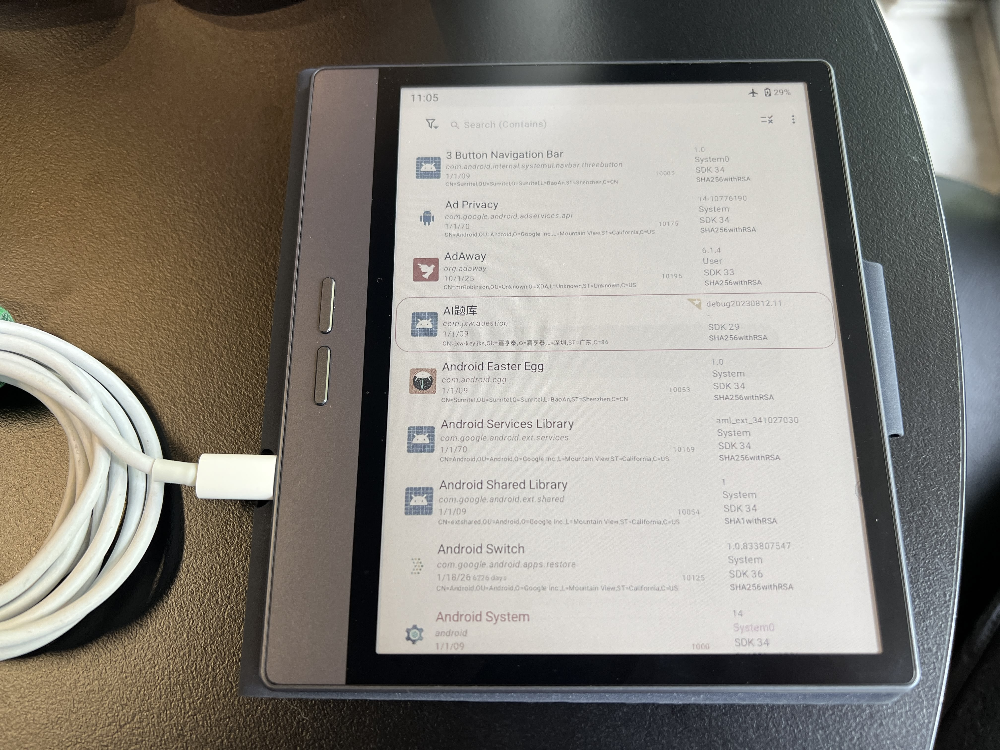

[Wallpaper by @RennerBricks](https://www.instagram.com/rennerbricks/) Check out their [YouTube
channel](https://www.youtube.com/watch?v=UZV90CUEzFU)

Congrats on getting your new Bigme B7 - I've had mine for about 3 months now and it's been quite solid. Compared with my previous tablet (an Onyx Boox Nova Pro), the screen isn't quite as crisp, however gaining colour, a newer version of Android and now root access is a bigger improvement. That plus (optional) cellular - If I wanted to use it as a travel hotspot is pretty neat to have.
If you're yet to purchase one, for reference I paid about $320 AUD shipped in Jan 2026 from Aliexpress. At this price it is decent value, however I wouldn't have purchased it if it was much more than this.

This article is more of a record of what I did to my Bigme B7 to gain root access in early 2026 - things may change by the time you're reading this article, and it may be worth being cautious!

A big **Credit to** [@ekalaitzis on
Github](https://github.com/ekalaitzis/Rooting-Bigme-B751C#important-preparation) who provided a great writeup this was based on.

 **Important Note** - Modifying your device carries the risk of bricking it. Proceed with **caution** and at your own risk.


## Steps

Due to some driver issues on both MacOS and Windows, I ended up loading Ubuntu as a live OS, which makes the steps below easy to reproduce, in a clean environment.

### 1. Environment Setup

*   **Live OS** - [Ubuntu](https://ubuntu.com/download/desktop) Linux recommended (Live CD can be created with – [balenaEtcher](https://etcher.balena.io/) or
[Ventoy](https://github.com/ventoy/Ventoy))

Load a Live environment in "Try mode" on a x86 based machine (not apple silicon or Raspberry pi) and open a terminal to follow with the following commands. It should go without saying, only follow the below if you're comfortable executing linux commands.

```
sudo apt update && sudo apt install python3 git libusb-1.0-0 python3-pip libfuse2
```

```
git clone https://github.com/bkerler/mtkclient
cd mtkclient
pip3 install -r requirements.txt
pip3 install .
```

#### install USB rules for Ubuntu
This step grants necessary permissions to access and communicate with USB devices (the Bigme B7).

```
sudo usermod -a -G plugdev $USER
sudo usermod -a -G dialout $USER
sudo cp mtkclient/Setup/Linux/*.rules /etc/udev/rules.d
sudo udevadm control -R
sudo udevadm trigger
```

### 2. Extract boot files from B7

The {location} is somewhere on your machine like `.` for the current directory or `~/Downloads` for the Downloads folder. If you're not familiar with how this works, it may be best to stop here and seek further assistance before proceeding.

mtk.py will extract the boot files for patching in the next steps. If the file is 0KB or similar, something may have gone wrong.

``` bash
python3 mtk.py rl --skip userdata {location}
```

1. Copy `boot_a.bin` and `vbmeta_a.bin` to a separate folder
2. Rename them to `original_boot_a.bin` and `original_vbmeta_a.bin` to keep them distinct from what we're working on


*   To patch the original bin, I used this web version which ended up working well
 [https://circlecashteam.github.io/MagiskPatcher/](https://circlecashteam.github.io/MagiskPatcher/) –
This site patches the device’s boot and vbmeta files – crucial for gaining root access.

Upload your original_boot_a.bin and use the settings:

* Keep Verity: OFF\
	Keep Force Encrypt: ON\
	Recovery Mode: OFF\
	Patch Vbmeta Flag: ON\
	Legacy SAR Device: OFF

If it's successful, you'll see a message like  
	`Success: Worker terminated.
	Success: Download starting...`
	
Then download and rename the file to `patched_boot.img` and move it the same folder.
	
Next, patch the vbmeta
	
```
python3 patch-vbmeta.py original_vbmeta_a.bin
```


### 3. Rooting Process

> ⚠️ WARNING
> **THIS STEP WILL ERASE YOUR DEVICE!**

1. **Wipe the device**:

```bash
python3 mtk.py e metadata,userdata,md_udc
```

Always make sure there are no errors after the commands

2. **OEM Unlock command**:

```bash
python3 mtk.py da seccfg unlock
```

3. **Bootloader unlock**:

```bash
python3 mtk.py da vbmeta 3
```

4. **Flash the patched boot images**:

```bash
python3 mtk.py w boot_a patched_boot.img
python3 mtk.py w boot_b patched_boot.img
```

5. **Flash patched vbmeta**:

```bash
python3 mtk.py w vbmeta_a patched_vbmeta.bin
python3 mtk.py w vbmeta_b patched_vbmeta.bin
```

6. **Finally, use this command to reboot**:

```bash
python3 mtk.py reset
```


Your device will boot as if it's the first time. Complete the initial setup process, install the Magisk APK, and verify root access works with a root checker app.

 


## Recovery Option

If something goes wrong, you can restore your backup with commands like:

```bash
python3 mtk.py w boot_a {LocationYouSavedBackup}/boot_a.bin
```

## Some things to do with root access

Without saying, you should always be careful what you give root access on a machine. Make sure you trust the apps before installing.

### Securing system, blocking unwanted behaviour
 

Root access can assist to give some added controls to your network settings when you do go online.
[Adaway](https://github.com/AdAway/AdAway) is one example of an ad blocker that you can use to control network access to

 

[Appmanager](https://github.com/MuntashirAkon/AppManager) is a great option too for 'Freezing' apps from running, which can also improve battery life. In my case,


### Installing apps with Obtanium

There are many flavours of app managers out there you can use in your new environment to install apps. Either directly via an APK, which you can send across with LocalSend or USB.
I went with [Obtanium](https://github.com/ImranR98/Obtainium), an app that downloads an open source app's APK directly from Github. Other options can include the Aurora, F-Droid or the Play store.


Leave a comment below if you need a hand or get stuck at any steps!


Acknowledgement goes to [@ekalaitzis](https://github.com/ekalaitzis/Rooting-Bigme-B751C?tab=readme-ov-file#important-preparation) on Github for testing on alternative Bigme devices first. Give them a star!


## Full list of links
- Wallpaper on my B7 [RennerBricks](https://www.instagram.com/rennerbricks/)
-  Github Repo with original instructions [ekalaitzis/Rooting-Bigme-B751C](https://github.com/ekalaitzis/Rooting-Bigme-B751C)
- mtkclient [bkerler/mtkclient](https://github.com/bkerler/mtkclient)
- vbmeta disable verification:
[WessellUrdata/vbmeta-disable-verification](https://github.com/WessellUrdata/vbmeta-disable-verification/releases/tag/v1.0.4)
- [Web Magisk Patcher](https://circlecashteam.github.io/MagiskPatcher/)
- [Adaway](https://github.com/AdAway/AdAway)
- [Appmanager](https://github.com/MuntashirAkon/AppManager)
- [Obtanium](https://github.com/ImranR98/Obtainium)


---
**Notes:** 

I noticed at times it looked like the device wouldn't boot, but holding the power button and waiting for the bigme 'block animation' helped for it to power on.

I'll update this section if anyone reaches out with any comments.
---