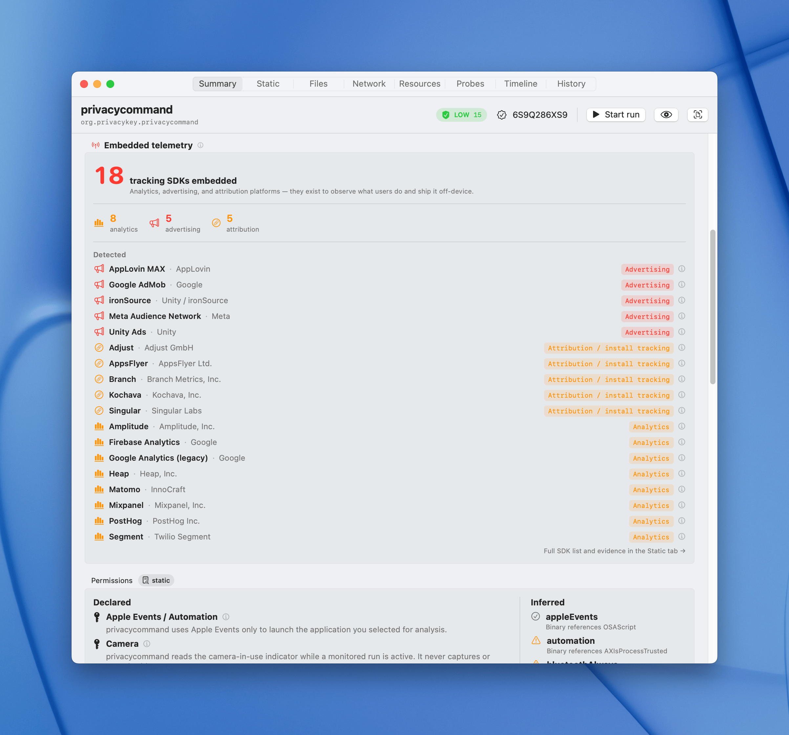
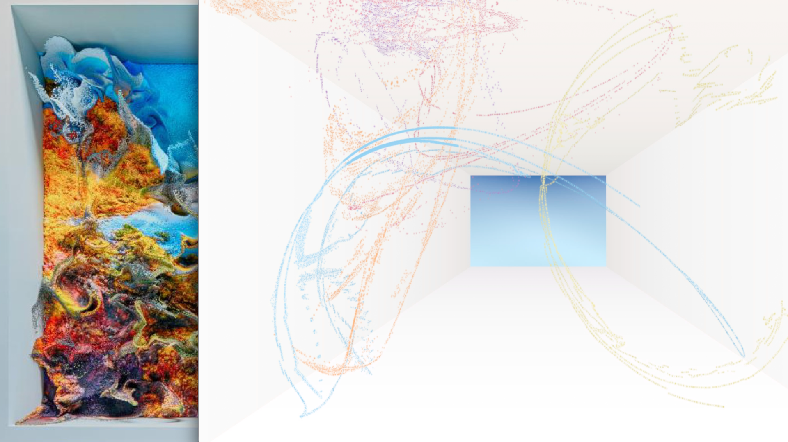

If you're like me, you might be getting bombarded with "AI" at every angle; news, SaaS platforms, support bots and coworkers. AI is finding it's place, and as an IT manager with a risk-first mindset, there are often complex data loss prevention (DLP) strategies an org should take to protect their data. But what if you or someone wants to harness AI for a simple coding project? I've spent the past two months diving deep into development with AI, for uni, work and personal projects.

My takeaway is 

> **AI coding assistants are like a first-year uni student, don't overcomplicate instructions and don’t expect them to solve what they haven’t seen before**

They've been trained on thousands of public repos. Give them a simple task built on a popular stack like React or Next.js, it'll blitz it. But ask it to solve something outside a norm and you'll quickly see the limits. Just like a student who’s never seen the problem before.

My own experience has been a mix of “wow" and “wait, that’s not what I asked for.”

Take [privacycommand](https://github.com/privacykey/privacycommand), a macOS tool I’ve been building. I used Claude in two ways. First, I gave directions as to what I wanted with every step. Whilst it was good to get going, I observed if it didn't know someting, there were a lot of assumptions made, often not what I wanted. 

The way I prefer to use Claude now is to get it to ask me questions. I find that it can be helpful, to flesh out areas of a problem I otherwise wouldn't have given directions to do.
From a product management perspective, this is exactly what I wanted: a low-friction way to stress-test ideas and validate them before committing to building.

Then I tried to build a Mac screen saver inspired by Refik Anadol’s *Quantum Memories* (the NGV Melbourne installation
from 2020). I asked to build an output that emphasises fluid dynamics with organic flow. What came back was small dot particles buzzing around like flies. Even through the Claude "ask" function to flesh out all the details, the end result was comically bad. 

 

This is a good graphical representation of what I asked for and what I got.

It's worth noting that the expertise required in order to understand the math, and the traditional tools that would have been used to render this can't come from an AI making a recommendation of the tech stack, at least not yet. I think this will be my LLM benchmark, like how [Simon Willison's Pelicans on a bike](https://simonwillison.net/2024/Oct/25/pelicans-on-a-bicycle/)

I’ve also leaned into cross-validation. I’ll run an OWASP Top 10 check through one model, a WCAG audit through
another, and a structural refactor back on the first. They don't always get everything right, but git is your safety net, and being sandboxed allows for an easy redo if one tool spits out rubbish.

A few things I found after two months:
- **Treat it like pair programming, not delegation.** Ask it to explain its reasoning. Push back when the output feels
off. AI often hallucinates.
- **Verify the security** Security, performance, and edge cases are where the "first-year student" needs help. Cross-check with someone who knows what's up, or with another AI.

I began my testing with Antigravity as there's a free 30 day trial of google's Gemini 3.1 Pro. Then moved to the free version of Codex (Using GPT 5.4 Pro), then to using my own self-hosted Qwen 3.6 with opencode and finally Claude. Whilst they're getting better and more accurate, it's always worth double checking the output, and having multiple models can be helpful to validate.

If you do start to develop with AI, I'd recommend disclosing its use. It's important to be transparent, so future devs who read your code can make appropriate decisions. If you want to take it a step further, only publish code with a secondary account or co-author commits with the AI tool so its obvious what's what.