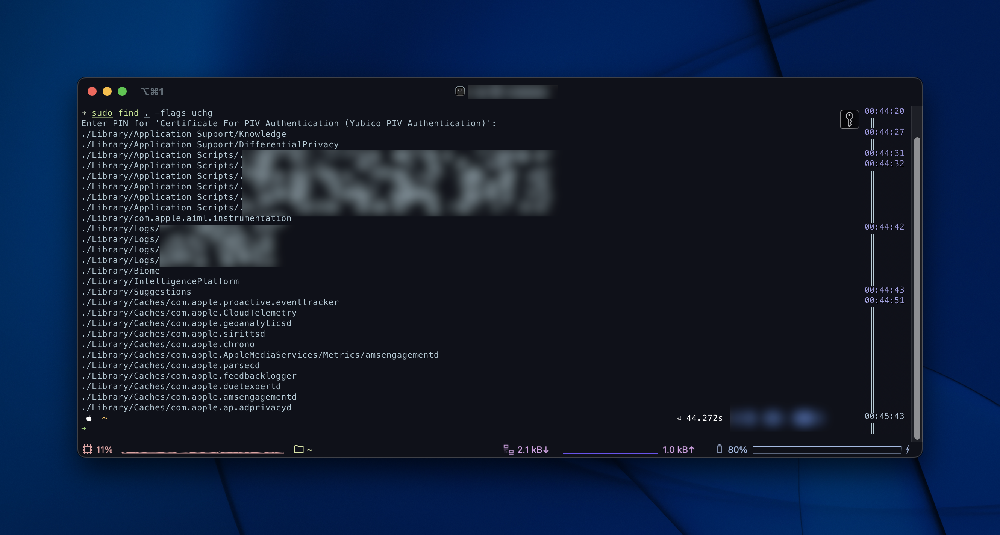
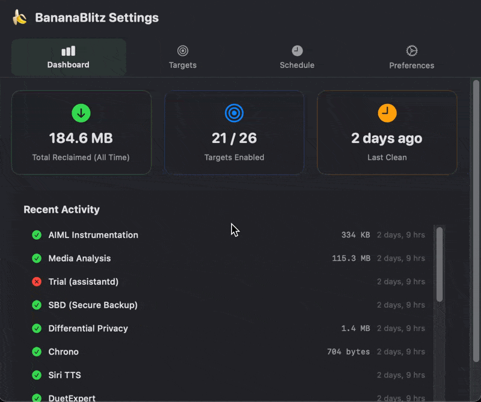
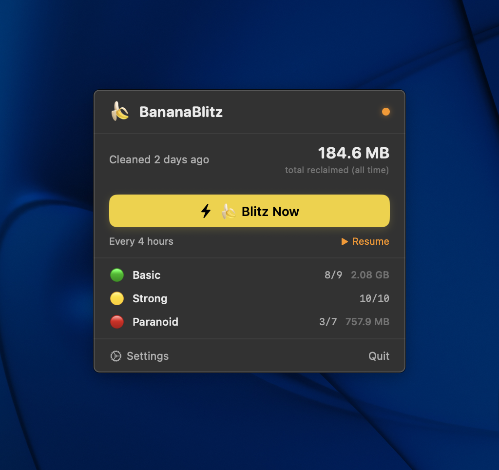
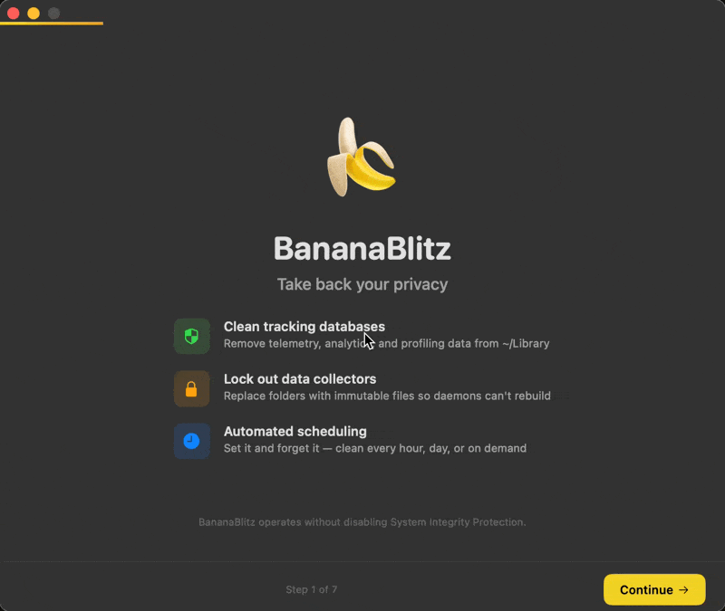

Last year I took IT Forensics FIT5223 which had a strong focus on Windows and at time Linux operating systems.
It was encouraged to learn about what was active on your operating system and how it works through analysis of artefacts.

Through some extra reading around Mac Forensics and utilising a nifty tool called [Sloth](https://github.com/sveinbjornt/Sloth), processes and their active files are visible. This got me thinking about my operating system. Whilst idle, i'd see processes like `adprivacyd` or `assistantd` among others working away gathering telemetry, most of the time harmless. But what i took note of was when I disabled siri, or explicitly told my OS that I didn't wan't to be profiled. I recognise that Apple are doing better than Google, Meta or Microsoft *cough * recall, but I think that a lack of transparency in the tool you use can erode user trust.
Apple's going to introduce more ads into Maps next, and who knows what other system app.

With System Integrity Protection (SIP) enabled, for security it generally is a good thing - protecting your operating system from being modified, usually in a malicious way. However when you want to unload daemons and tell your operating system that you don't want an app to run, if you can't stop a service, are you really in control?

As a way to try to combat the apps to clear this telemetery and metadata, I vibecoded [BananaBlitz](https://github.com/adamXbot/BananaBlitz), on my AdamXbot github. The goal is to be a lightweight utility that periodically cleans up system telemetry databases, Siri intelligence metrics, and tracking logs within your ~/Library folder.

My favourite feature, and way to do it is through a smart directory locking: replacing directories with immutable empty files to block intrusive re-creations natively using `uchg`.
If you're curious, you can use the command `find . -flags uchg` to see all the files that are locked.

The app is fairly functional and lightweight, and of course open source on Github.
It makes sense if sometime in the future I codesign the app, especially if you're messing with system files.

There's a bit of info available also to anyone using the app, to get a bit of an understanding of what some daemons do, and the impact of wiping data. You can also individually change the method, if you just want to use it as a clean up utility, or as a way to try to stop the service from running entirely.

It lives in your menu bar, where you can toggle a 'blitz' or see the status.

> As always, before installing stuff, i'd recommend testing in a virtual machine or sandboxed instance. `BananaBlitz` is in beta, and may have bugs or act in an unverified way.

Check it out on [Github](https://github.com/adamXbot/BananaBlitz) - i'm open to pull requests and feedback!
