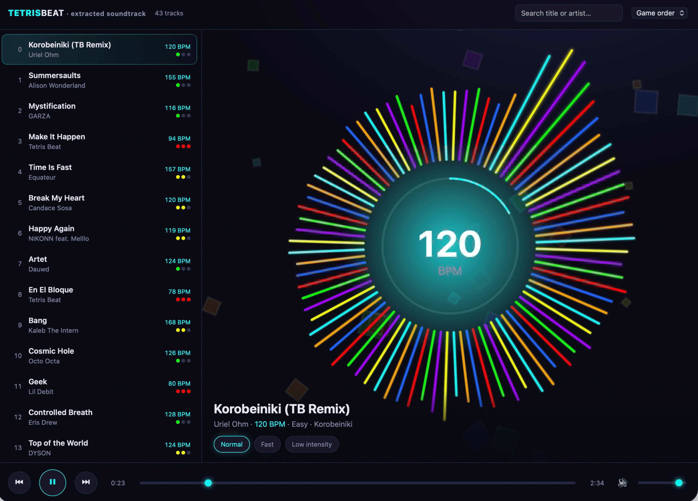

Tetris Beat is a snapshot of history, and a bit of a warning of what may happen to games on Apple Arcade when they're no longer popular or profitable. It's now been removed, and unless you had a copy of the .app sitting around in a time machine backup, it can be lost entirely.

I quite like physical media, and think its important to preserve and remember things that have had an impact in your life.
Tetris Beat isn't the best version of falling blocks, but it had some banger tunes that were licensed just for the game, and aren't available anywhere else on the internet. Some may argue they aren't that great (that audio in effect is more immersive.. Try the multiplayer modes and you'll realise it isn't), but when you've played hours of a game with the same songs going over and over, it can sway power to bring back some memories.

It launched in August 2021 and was quietly removed in August 2024, and the music went with it. So one arvo, after finding the app in my backups, and an interest to test the Fable model, I went and got the songs.

> **TLDR;** Tetris Beat hid its soundtrack in a heap of numbered `.wem` files. A weekend, three open-source tools and one content-hash later, all 43 tracks are out — rescued from a game that no longer exists. [code available on Github](https://gist.github.com/AdamXweb/41b78bf9c10fc95574f53d882d98ed35)

## Game audio in game codecs

Tetris Beat is a **Unity** game, with audio handled by **Wwise**, a specialist bit of kit used to make game audio react in real time. And Wwise doesn't store named MP3s, but packs them into cryptic `.wem` and `.bnk` formats named with numeric IDs. So on disk it's a folder full of `12345678.wem` files and no obvious way to listen to them.

## Thank you open source

There's a great community that's already built the hard parts to extract the audio: **vgmstream** to decode, **UnityPy** to read Unity's asset files, and **wwiser** to make sense of how a soundbank is put together.

## The songs that were never finished

Some forensics of the app showed that not every track ships as a finished song.
There are also a few that ship with the vocals, bass, drums and rhythm as separate layers that the game blends live while you play.
For those I stacked the layers back together. It's recognisably the song, just not the polished master. (An interesting find: the game launched with 18 songs, and I found exactly 18 finished masters buried in the files. The rest, added month by month afterwards, only ever shipped as stems - the layers of the song.)

## Full soundtrack

I  got Clause to make a mini web player that was block themed just as a mini celebration.

<strong>The full 43-track catalogue</strong> (click to expand)

| # | Title | Artist | BPM |
|---:|---|---|---:|
| 0 | Korobeiniki (TB Remix) | Uriel Ohm | 120 |
| 1 | Summersaults | Alison Wonderland | 155 |
| 2 | Mystification | GARZA | 116 |
| 3 | Make It Happen | Make It Happen | 93.5 |
| 4 | Time Is Fast | Equateur | 157 |
| 5 | Break My Heart | Candace Sosa | 120 |
| 6 | Happy Again | NIKONN feat. Melllo | 119 |
| 7 | Artet | Dauwd | 124 |
| 8 | En El Bloque | En El Bloque | 78.5 |
| 9 | Bang | Kaleb The Intern | 168 |
| 10 | Cosmic Hole | Octo Octa | 126 |
| 11 | Geek | Lil Debit | 79.5 |
| 12 | Controlled Breath | Eris Drew | 128 |
| 13 | Top of the World | DYSON | 124 |
| 14 | Play With My Heart | Hannah Diamond | 135 |
| 15 | Caza Raton | Dru Flecha | 104 |
| 16 | Date Night | CINTHIE | 124 |
| 17 | Dominoes | CARNE XL | 72.5 |
| 18 | I'm Just Saying | Gidi & Deraj | 123 |
| 19 | HYDRA | DJ QBERT | 100 |
| 20 | Fall For You | Marcopatino | 128 |
| 21 | Dancing All Alone | Katherine Ho | 122 |
| 22 | Takusan | Miyachi | 74 |
| 23 | Por Ti | B NAIN | 138 |
| 24 | Burst | YTN Tee x Kay | 130 |
| 25 | Lovely Journey | Marina Trench | 118 |
| 26 | Slingshot | Halo Sol | 145 |
| 27 | Snowball | Laura BCR | 125 |
| 28 | Accidental Love | BAIYU | 120 |
| 29 | Get Set | Jason Chu | 95 |
| 30 | Money Over Here | Baby Blak | 79 |
| 31 | Falling Fantasy | D. Tiffany | 130 |
| 32 | New Wave | Voli Contra | 95 |
| 33 | Battle Mode | The Fresh Crew | 170 |
| 34 | Covered - Fvntvcy Remix | Importz feat. Jade Josephine | 108 |
| 35 | No Dance | CYRK | 129 |
| 36 | Feelin' | Nate Harlan | 100 |
| 37 | Time Is Like Gold | Iron Mic Family feat. A.T.L. | 92 |
| 38 | Mo Maloya | Ribongia feat. Simangavole | 156 |
| 39 | Yeah Yeah | Nardo Says | 94 |
| 40 | Far Away | Nomdecode Spartacus | 120 |
| 41 | Phases and Faces | GARZA | 124 |
| 42 | Feel Something | Title.Wav | 120 |

A little context for the effort: Tetris was made by **N3TWORK**, and the franchise holds the Guinness World Record for the most official versions of a video game — somewhere north of 200 releases across 65-odd platforms. Tetris Beat is the one you can't play anymore. Which is really the whole reason this project exists, once it left Arcade the music left with it.

The full script is here: **[gist link](https://gist.github.com/AdamXweb/41b78bf9c10fc95574f53d882d98ed35)**. You'll need a copy of the Tetris Beat app, then you'll be able to relive all the music or **spoiler** maybe even play your own...

