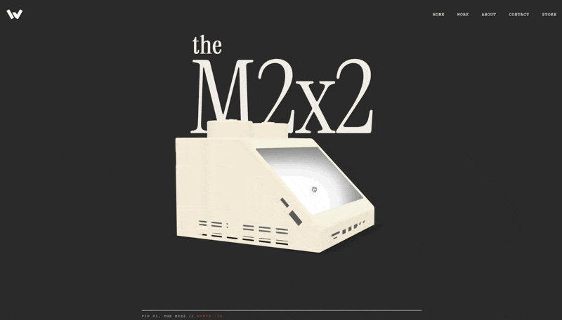

Better to just check out [The M2X2](https://www.wattiv.nl/work/m2x2/), as it's a work of art. Not just the product, but the interaction on the website is a fun read if you're into lego, tech or design.
I grew up with a few bricks that looked like this, and although as a kid I didn't really like the design as it wasn't detailed enough, finally the screen can show anything your mac throws onto it.

They are also a mad lad for open sourcing it and making the [bits available to 3d print at home](https://makerworld.com/en/models/2469337-the-m2x2-a-mac-mini-m4-case#profileId-2710965)

Finally, a justification for to buy a 3d printer
