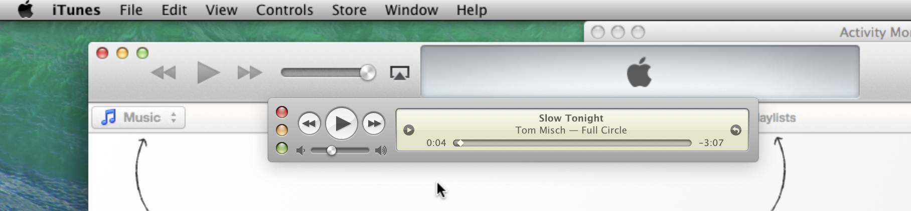
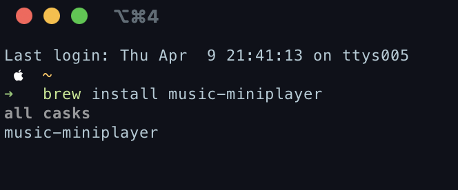
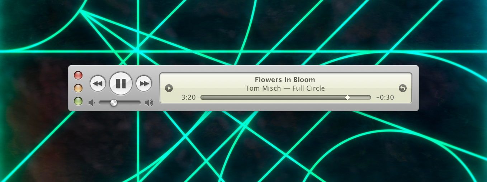

Funnily enough, I was playing around with [older versions of MacOS](/blog/mavericks-in-utm-on-silicon) recently, and had nostalgia to the design elements of MacOS. I especially remember the aluminium, and the sliding interface controls of iTunes reminding me of the skeuomorphism days.

It's got the feel of iTunes 5.0 according to this [Arstechnica article](https://arstechnica.com/gadgets/2012/11/itunes-through-the-ages/) which honestly was before my time switching to MacOS. 

There are enough features to be helpful to control your music, but not enough to be distracting. The ability to keep on top is nifty and makes it a simple fun app to control your music.

[Music Mini player](https://marioaguzman.github.io/musicminiplayer/) is available to download directly, or via brew
`brew install music-miniplayer`

If only it could control other apps besides Apple Music..

