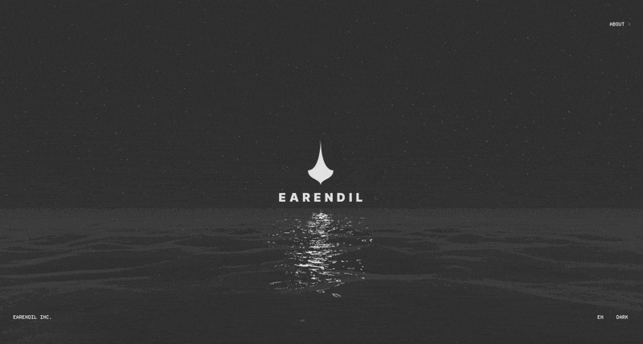

I've found some of the best 3D waves i've ever seen in a browser. I'm a sucker for digital noise, and this design language is very attractive and coherent.

Styled in both light and dark mode, you can view the waves in realtime on the [earendil website](https://earendil.com), or view the code over on [Github](https://github.com/earendil-works/website/tree/bd4322a0e6498bcd538abe3c7a1b7111acd9df24)

The magic happens from line [595 as of April 2026](https://github.com/earendil-works/website/blob/bd4322a0e6498bcd538abe3c7a1b7111acd9df24/_static/script.js#L595). Kudos to Armin, Colin and team for making this all open source, a good way to learn and understand how talented people work.

In case the site is no longer available, you can see a screen recording below.

